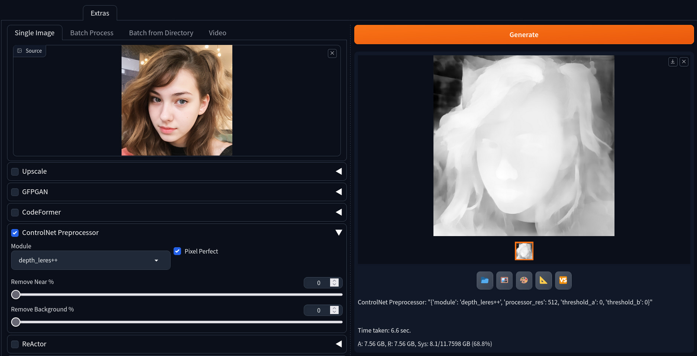

# ControlNet Preprocessor in extras tab

This extention adds controlnet preprocessing feature from [Mikubill/sd-webui-controlnet](https://github.com/Mikubill/sd-webui-controlnet) into [stable-diffusion-webui](https://github.com/AUTOMATIC1111/stable-diffusion-webui) into "Extras" tab. You need to have installed sd-webui-controlnet

You can use it for processing videos, using my other extension: [sd-webui-video-extras-tab](https://github.com/light-and-ray/sd-webui-video-extras-tab)

Also it supports `sd-webui-forge`
